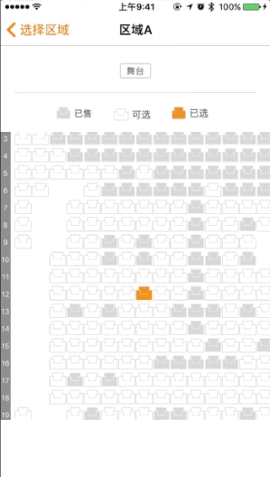

# UCSeatsPicker

A simple and efficient seat control, it can display a variety of seating styles, and supports custom stretching ratio, seat information transmission, and so on, I hope it is you want.

## Introduction

UCSeatsPicker can help us to achieve the following results



## Swift Package Manager

Add to your `Package.swift`:

```swift
let package = Package(
  dependencies: [
    .package(url: "https://github.com/prongbang/UCSeatsPicker.git", from: "0.0.10"),
  ],
)
```

UCSeatsPicker There are three main categories, namely UCSeatsPicker, UCSeatsPickerIndexView and UCSeatsItem. The following brief description of the various types of functions is to use!
The UCSeatsPicker is the main display class. We can use it as a UIView when we use it. In addition, you need to tell it the size, number of rows, number of columns, and number of columns you want to display. Seat information can be. In addition, this class provides a way to set the state of the picture, if we do not call the change method or image pass empty, UCSeatsPicker will use the framework of the internal image resources.
UCSeatsPickerIndexView is a helper class that indicates the line number in the UCSeatsPicker and does not need to be set outside.
UCSeatsItem is a model class, a UCSeatsItem object represents a seat information displayed on the UCSeatsPicker.
Finally, we can achieve UCSeatsPickerDelegate method to obtain the user to select the seat information, and control the user when the seat selection behavior.

## Basic usage

UCSeatsPicker can be added as a normal View to the view, as we usually add other child controls. E.g:

```objc
- (void)viewDidLoad 
{
    [super viewDidLoad];
    UCSeatsPicker *picker = [UCSeatsPicker new];
    picker.cellSize = CGSizeMake(24, 24);
    picker.minimumZoomScale = 1;
    picker.maximumZoomScale = 2;
    picker.seatsDelegate = self;
    [picker setImage:[UIImage imageNamed:@"seat_available"] forState:UIControlStateNormal];
    [picker setImage:[UIImage imageNamed:@"seat_unavailable"] forState:UIControlStateDisabled];
    [picker setImage:[UIImage imageNamed:@"seat_selected"] forState:UIControlStateSelected];
    [self.view addSubview:picker];
    _seatsPicker.frame = CGRectMake(0, 100, kScreenWidth, kScreenHeight * 0.6);
}
```

We can implement the `UCSeatsPickerDelegate` method to get the seat information selected by the user, and control the behavior of the user when making selections.

```objc
- (BOOL)shouldSelectSeat:(UCSeatItem *)seatInfo inPicker:(UCSeatsPicker* )picker;
- (BOOL)shouldDeselectSeat:(UCSeatItem *)seatInfo inPicker:(UCSeatsPicker* )picker;

- (void)seatsPicker:(UCSeatsPicker* )picker didSelectSeat:(UCSeatItem *)seatInfo;
- (void)seatsPicker:(UCSeatsPicker* )picker didDeselectSeat:(UCSeatItem *)seatInfo;

- (void)selectionDidChangeInSeatsPicker:(UCSeatsPicker *)picker;

```

Refer to the example project for detailed information.

## Thank you

[FVSeatsPicker](https://github.com/iforvert/FVSeatsPicker)

## License

UCSeatsPicker is available under the MIT license. See the LICENSE file for more info.